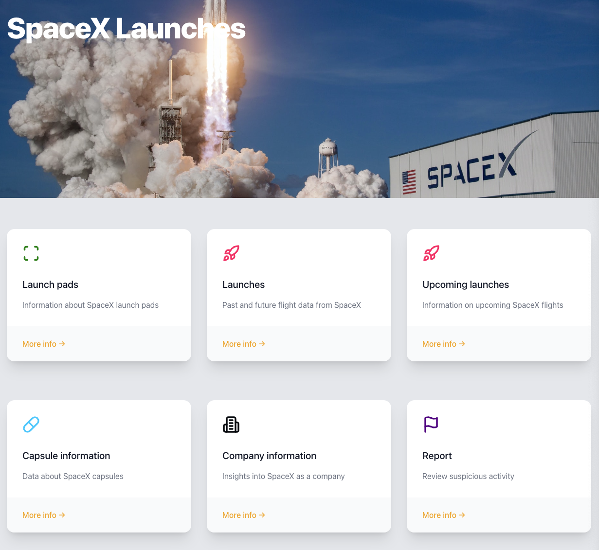
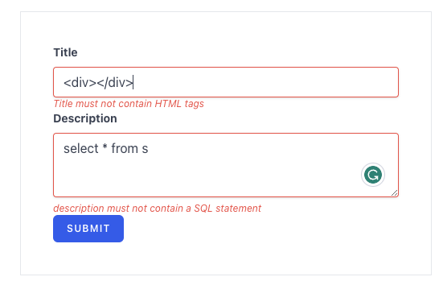

# SpaceX React GraphQL

A React app integrated with Apollo Client and GraphQL using the free and open SpaceX API.

Check live preview 🚀[SpaceX-Graphql-React](https://space-x-graph-ql-react.vercel.app/).
🚀
### Techstack

- [TypeScript](https://www.typescriptlang.org/)
- [React](https://reactjs.org/)
- [TailwindCSS](https://tailwindcss.com/)
- [Apollo GraphQL](https://www.apollographql.com/)
- [GraphQL Code Generator](https://www.graphql-code-generator.com/) with `React-Apollo Hooks` schema
- [Sentry](https://www.sentry.io/)
- [Redux](https://redux.js.org/)

### Feature

Display **SpaceX** data:
- Launches Pads 🚀
- Launches & upcoming launches 🚀
- Capsule Information 💊
- Company Information 🏠

Functionality:
- Sorting (All Field)
- Filtering (All Field)
- Dynamic Field Selection
- Submit Report via Redux
- Redux data persistency (localhost)
- Capture error❌ in sentry
- Dark Mode 

Field Validation
- Prevent HTML, SQL, credit card number injection
  

